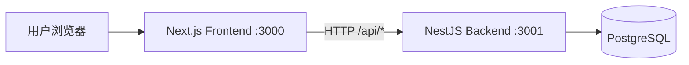
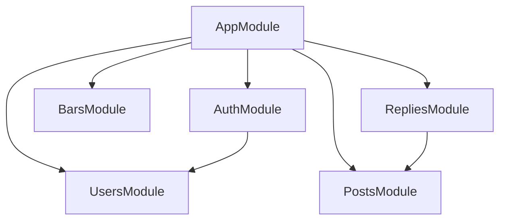

# 使用文档（基于当前代码实现）

本文档基于当前仓库 `backend/` 与 `frontend/` 实际代码整理，包含：
- 项目架构关系与模块图谱
- 目录与模块职责
- 前后端 API 接口说明
- 当前已支持功能与用户使用链路

## 1. 项目架构关系与图谱

### 1.1 运行架构



说明：
- 前端通过 `NEXT_PUBLIC_API_URL` 调用后端 API（默认 `http://localhost:3001`）。
- 后端在 `main.ts` 中设置全局前缀 `api`，所以实际接口统一为 `/api/...`。
- 数据持久化由 TypeORM 映射到 PostgreSQL（实体：User / Bar / BarMember / Post / Reply）。

### 1.2 后端模块关系



说明：
- `AuthModule` 依赖用户模块完成认证和当前用户信息。
- `RepliesModule` 依赖 `PostsModule` 完成“发回复后同步帖子 reply_count / last_reply_at”。

## 2. 目录结构与模块职责

### 2.1 仓库级目录

- `backend/`：NestJS 后端服务（认证、吧、帖子、回复 API）
- `frontend/`：Next.js 前端应用（首页、吧详情、帖子详情、登录注册、发帖）
- `DOC/`：使用文档与阶段说明
- `DEVELOP/`：研发规划文档

### 2.2 后端目录（`backend/src`）

- `main.ts`：应用启动、CORS、全局 `ValidationPipe`、统一响应拦截器、异常过滤器
- `app.module.ts`：模块装配与 TypeORM 配置
- `common/`：跨模块公共能力（鉴权 Guard、装饰器、响应信封、异常处理）
- `modules/auth/`：注册、登录、`/auth/me`
- `modules/users/`：用户实体与用户服务
- `modules/bars/`：吧列表/详情与吧实体（含 `bar-member` 关系）
- `modules/posts/`：帖子列表、详情、创建
- `modules/replies/`：帖子回复列表、发布回复、楼层号维护

### 2.3 前端目录（`frontend/src`）

- `app/`：App Router 页面
  - `page.tsx` + `HomeClient.tsx`：首页帖子流与推荐吧
  - `bars/[id]/page.tsx`：吧详情 + 吧内帖子
  - `posts/[id]/page.tsx`：帖子详情 + 回复区
  - `create-post/page.tsx`：发帖页（登录后可用）
  - `login/page.tsx` / `register/page.tsx`：登录注册
- `components/`：通用 UI 组件（导航、帖子卡片、回复卡片等）
- `lib/api-client.ts`：浏览器端 API 客户端（axios + JWT 注入 + 401 处理）
- `lib/server-api.ts`：服务端拉取 API（含多 base URL 回退）
- `lib/auth.ts`：Zustand 登录态存储
- `types/index.ts`：前端数据类型与统一接口响应类型

## 3. 后端 API 文档（当前实现）

> Base URL: `http://localhost:3001`  
> Prefix: `/api`

### 3.1 统一响应格式

```json
{
  "data": {},
  "meta": null,
  "error": null
}
```

列表接口返回示例：

```json
{
  "data": ["..."],
  "meta": { "cursor": "...", "hasMore": true },
  "error": null
}
```

### 3.2 认证与鉴权

- 登录/注册返回 `accessToken`（JWT）
- 受保护接口需要：`Authorization: Bearer <token>`
- 当前需鉴权的接口：
  - `GET /api/auth/me`
  - `POST /api/posts`
  - `POST /api/posts/:postId/replies`

### 3.3 接口清单

#### Auth

1. `POST /api/auth/register`
- 请求体：
```json
{ "email": "user@example.com", "password": "123456", "nickname": "昵称" }
```
- 响应 `data`：`{ accessToken, user }`

2. `POST /api/auth/login`
- 请求体：
```json
{ "email": "user@example.com", "password": "123456" }
```
- 响应 `data`：`{ accessToken, user }`

3. `GET /api/auth/me`（需登录）
- 响应 `data`：当前用户信息（不含密码）

#### Bars

1. `GET /api/bars?cursor=&limit=`
- 说明：按 `createdAt DESC` 游标分页，默认 `limit=20`，最大 `100`

2. `GET /api/bars/:id`
- 说明：获取吧详情

#### Posts

1. `GET /api/posts?barId=&cursor=&limit=`
- 说明：支持按 `barId` 过滤；按 `createdAt DESC` 游标分页

2. `GET /api/posts/:id`
- 说明：获取帖子详情（含 author / bar 关联）

3. `POST /api/posts`（需登录）
- 请求体：
```json
{
  "barId": "uuid",
  "title": "帖子标题",
  "content": "帖子内容",
  "contentType": "plaintext"
}
```

#### Replies

1. `GET /api/posts/:postId/replies?cursor=&limit=`
- 说明：按 `floorNumber ASC` 游标分页，`cursor` 为楼层号的 base64

2. `POST /api/posts/:postId/replies`（需登录）
- 请求体：
```json
{
  "content": "回复内容",
  "contentType": "plaintext",
  "parentReplyId": "可选"
}
```

## 4. 前端与后端 API 对应关系

- 首页
  - `GET /api/posts?limit=20`
  - `GET /api/bars?limit=12`
- 吧详情页
  - `GET /api/bars/:id`
  - `GET /api/posts?barId=:id&limit=20`
- 帖子详情页
  - `GET /api/posts/:id`
  - `GET /api/posts/:id/replies?limit=50`
  - 登录后可 `POST /api/posts/:id/replies`
- 登录/注册页
  - `POST /api/auth/login`
  - `POST /api/auth/register`
- 发帖页（登录后）
  - `GET /api/bars`
  - `POST /api/posts`

## 5. 当前已支持功能（按用户可见）

### 5.1 匿名用户
- 浏览首页帖子流
- 浏览推荐吧并进入吧详情
- 查看帖子详情与回复列表
- 查看登录与注册页面

### 5.2 登录用户
- 登录后保持本地会话（localStorage + Zustand）
- 在发帖页选择吧并发布帖子
- 在帖子详情页发布回复
- Token 失效（401）时自动清理登录态并跳转登录页

### 5.3 系统能力
- 统一响应信封（`data/meta/error`）
- 列表接口游标分页（bars/posts/replies）
- 统一参数校验与异常格式化

## 6. 用户使用链路（当前主链路）

### 链路 A：游客浏览
1. 进入首页 `/` 查看帖子流与推荐吧
2. 点击帖子进入 `/posts/:id` 查看主楼与回复
3. 点击吧进入 `/bars/:id` 查看吧信息与吧内帖子

### 链路 B：注册并发帖
1. 进入 `/register` 完成注册
2. 自动登录后进入首页
3. 进入 `/create-post`，选择吧、填写标题和内容
4. 提交成功后跳转帖子详情页

### 链路 C：登录并回复
1. 进入 `/login` 登录
2. 打开任意帖子详情 `/posts/:id`
3. 在回复框提交内容
4. 回复成功后可在楼层列表看到新回复

## 7. 当前边界（尚未在代码中实现）

- 吧创建/编辑/管理后台
- 点赞、收藏、分享
- 二级回复交互完善（当前后端支持 `parentReplyId` 字段，前端未提供完整二级回复 UI）
- AI 辅助能力（重复帖检测、审核提示、摘要）
